<h1 align="center">
  
  Book Wise
</h1>

<p align="center">
  

  
  
  <a href="https://github.com/pabloxt14/book-wise/commits/master">
    
  </a>
    
   

   <a href="https://github.com/pabloxt14/book-wise/stargazers">
    
  </a>
</p>

<p>
  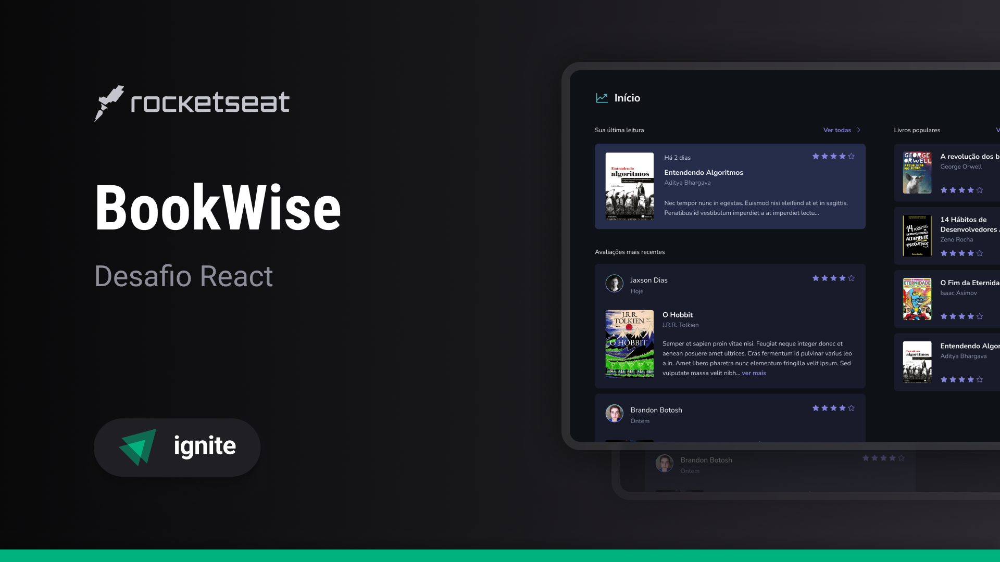
</p>

<h4 align="center"> 
	🚀 Aplicação finalizada 🚀
</h4>

<p align="center">
 <a href="#-about">About</a> |
 <a href="#-deploy">Deploy</a> |
 <a href="#-layout">Layout</a> | 
 <a href="#-how-it-works">How It Works</a> | 
 <a href="#-technologies">Technologies</a> | 
 <a href="#-author">Author</a> | 
 <a href="#-license">License</a>
</p>


## 💻 About

O projeto **Book Wise** é uma plataforma de recomendações de livros para leitores, um lugar onde eles possam avaliar e ver avaliações de outros leitores sobre os mais diversos livros.

Vale ressaltar que este projeto foi desenvolvido como conclusão de um desafio proposto no curso/trilha **Ignite React** oferecido pela [Rocketseat](https://www.rocketseat.com.br/).

---

## 🔗 Deploy

O deploy da aplicação pode ser acessada através da seguinte URL base: https://pabloxt14-book-wise.vercel.app/

---

## 🎨 Layout

Você pode visualizar o layout do projeto através [desse link](https://www.figma.com/file/jTau6bMNSF10GkqwYAbuLA/BookWise/duplicate). É necessário ter conta no [Figma](https://www.figma.com/) para acessá-lo.

Veja uma demonstração visual das principais telas da aplicação:

### Login

<p align="center">
  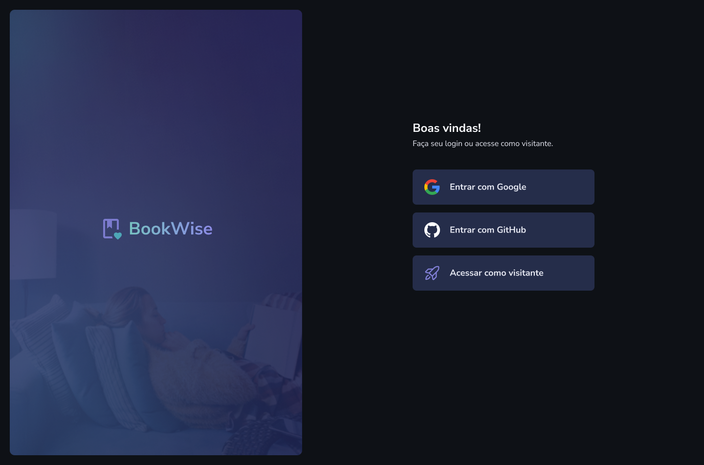
</p>

### Início

<p align="center">
  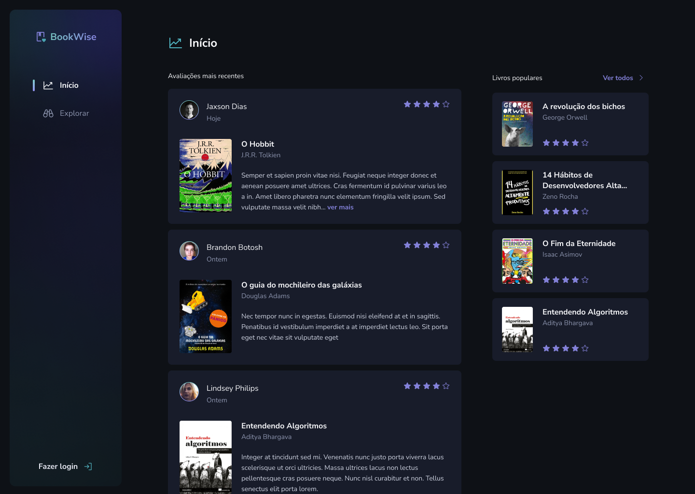
</p>

<p align="center">
  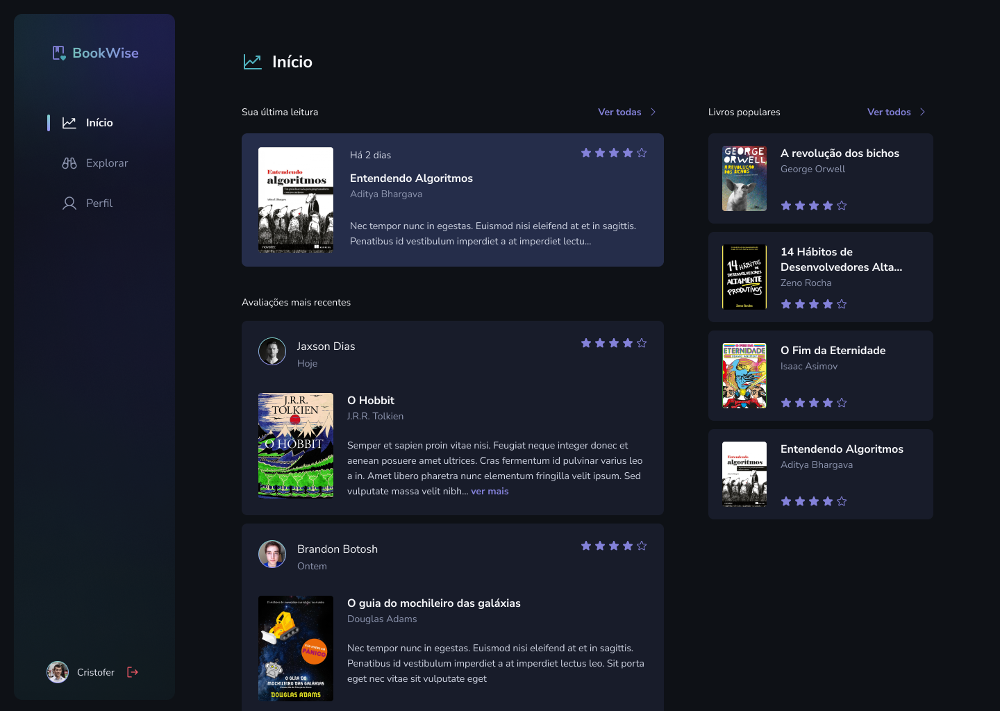
</p>

### Perfil

<p align="center">
  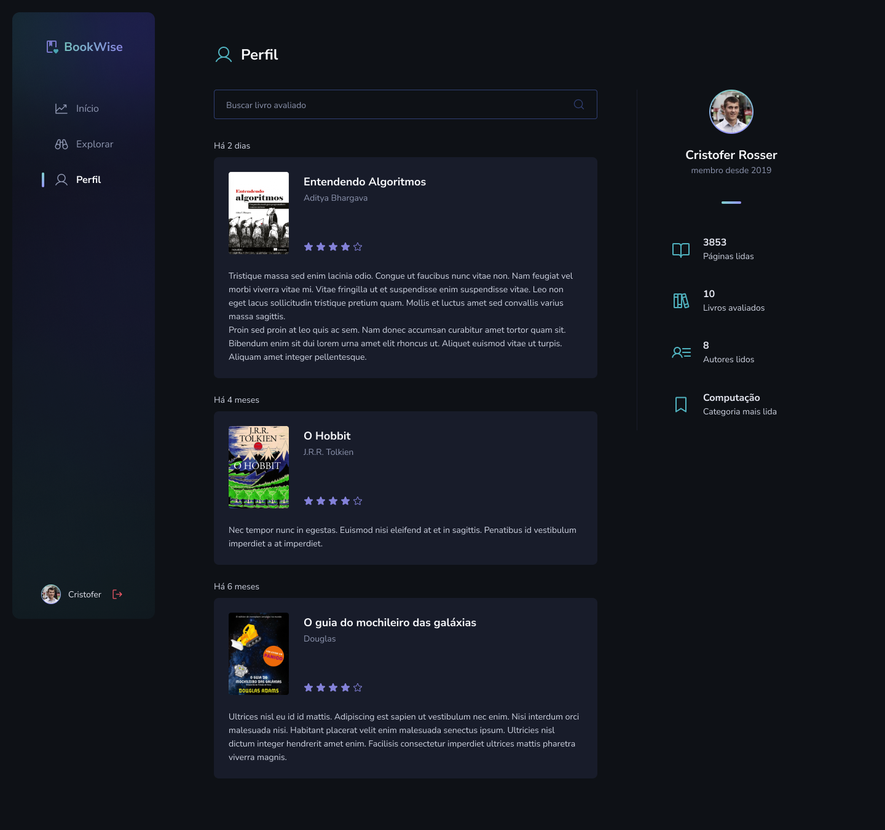
</p>

<p align="center">
  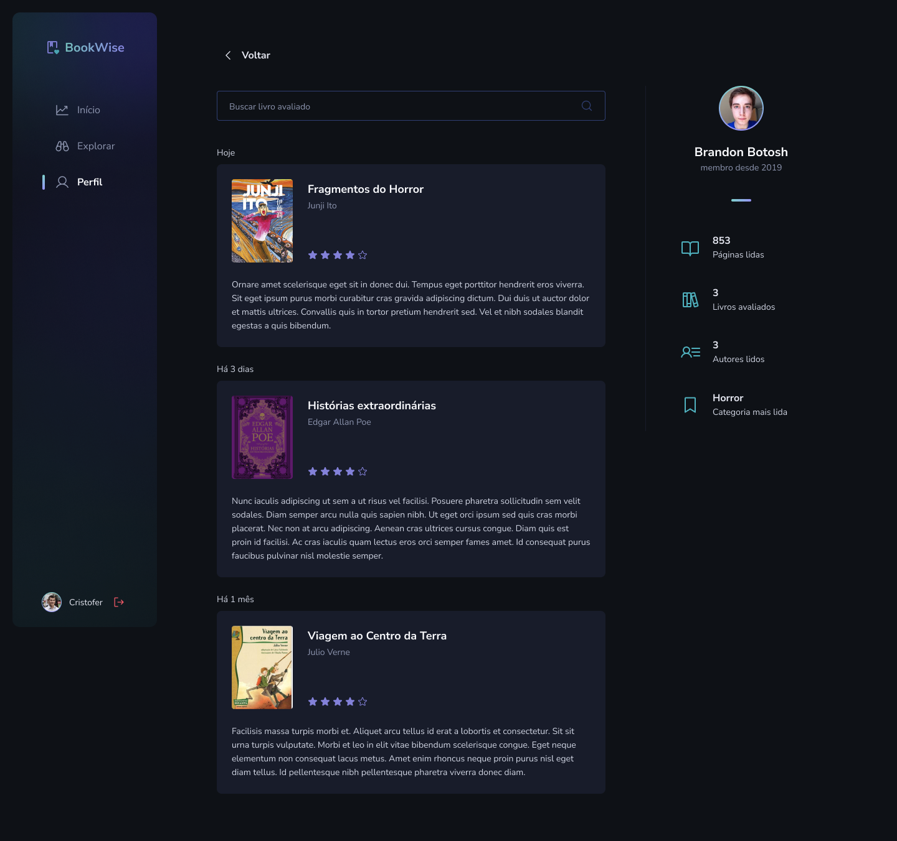
</p>

### Explorar

<p align="center">
  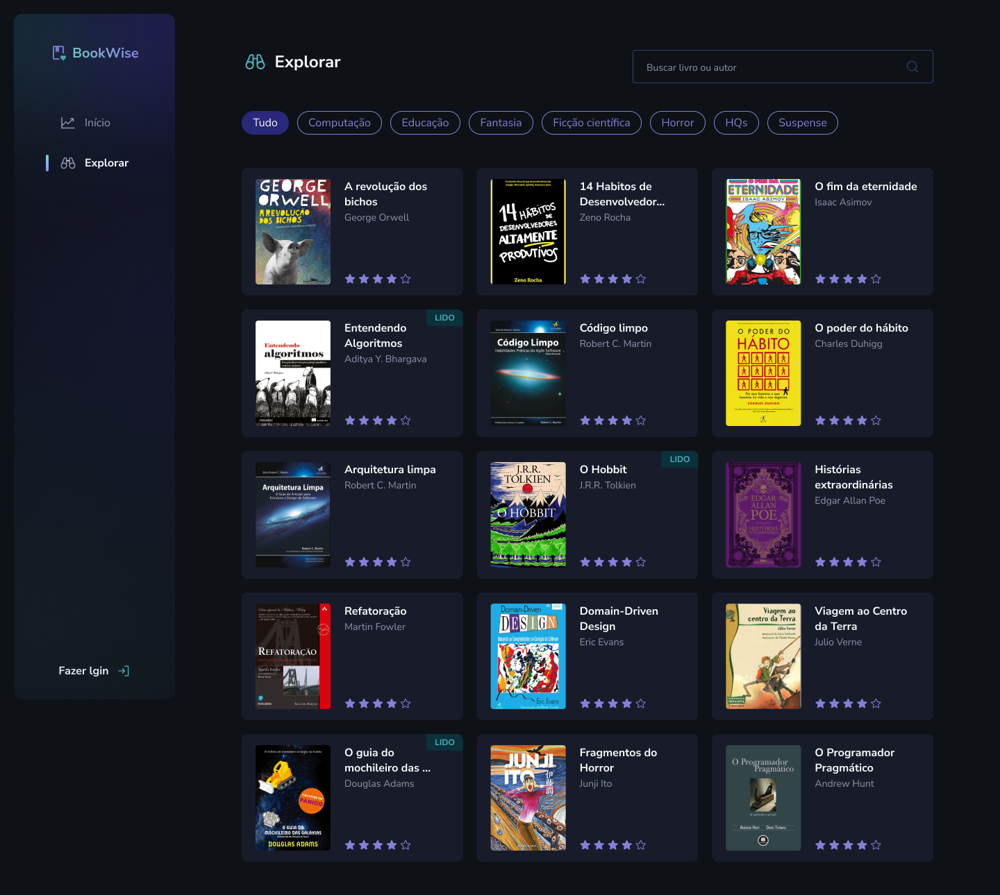
</p>

<p align="center">
  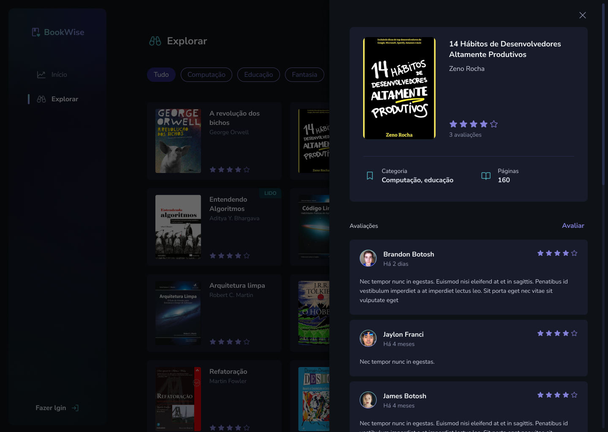
</p>

<p align="center">
  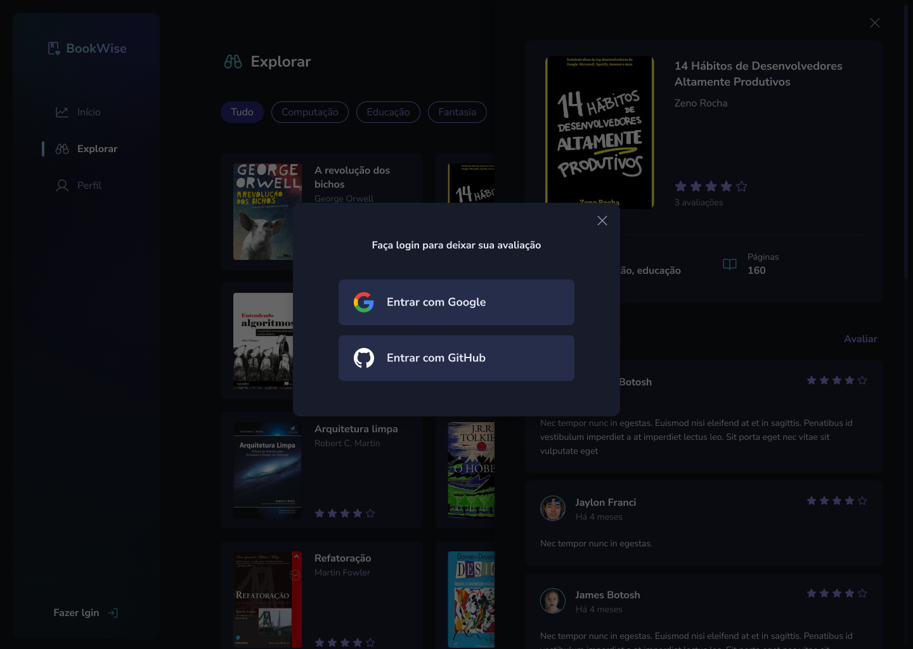
</p>

<p align="center">
  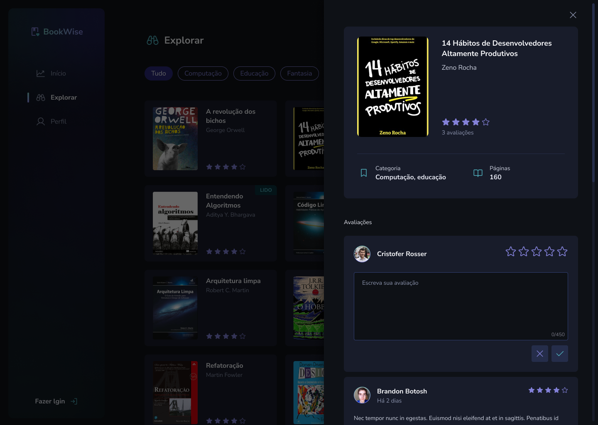
</p>

<p align="center">
  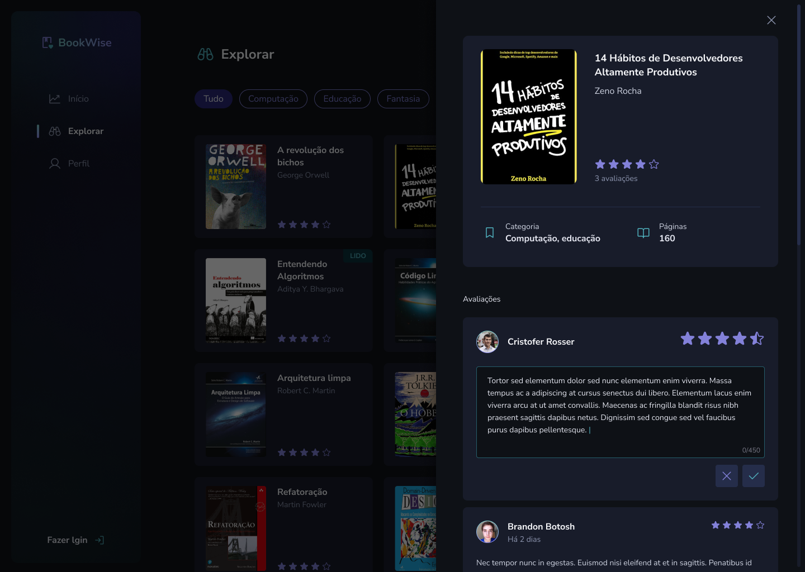
</p>

<p align="center">
  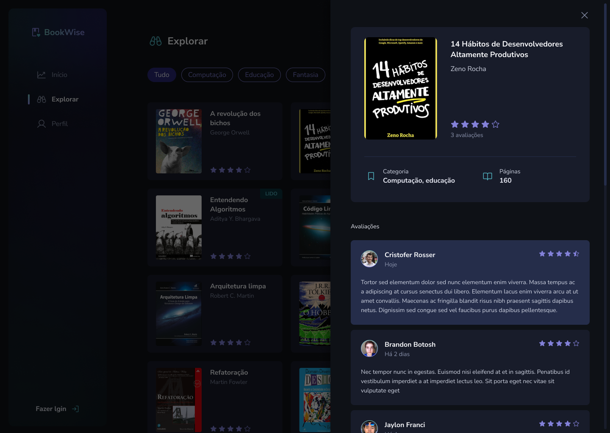
</p>

---

## 🚀 How it works

### Pré-requisitos

Antes de baixar o projeto você vai precisar ter instalado na sua máquina as seguintes ferramentas:

* [Git](https://git-scm.com)
* [NodeJS](https://nodejs.org/en/)
* [Yarn](https://yarnpkg.com/) ou [NPM](https://www.npmjs.com/)
* Para o banco de dados ter o [PostgreSQL](https://www.postgresql.org/) ou [Docker](https://www.docker.com/) para baixar a imagem do banco.

Além disto é bom ter um editor para trabalhar com o código como [VSCode](https://code.visualstudio.com/)

### Clonando e Executando

Passo a passo para clonar e executar a aplicação na sua máquina:

```bash
# Clone este repositório
$ git clone git@github.com:pabloxt14/book-wise.git

# Acesse a pasta do projeto no terminal
$ cd book-wise

# Instale as dependências
$ npm install

# Crie uma arquivo .env e preencha conforme apresentado no arquivo .env.example

# Executar seu banco de dados

# Executar o seguinte comando para criar as migrations no banco
$ npx prisma migrate dev

# Execute a aplicação em modo de desenvolvimento
$ npm run dev

# A aplicação inciará em alguma porta disponível que poderá ser acessada pelo navegador
```

---

## 🛠 Technologies

As seguintes principais ferramentas foram usadas na construção do projeto:

- **[TypeScript](https://www.typescriptlang.org/)**
- **[Next.js](https://nextjs.org/)**
- **[Stitches](https://stitches.dev/)**
- **[RadixUI](https://www.radix-ui.com/)**
- **[Prisma](https://www.prisma.io/)**
- **[Zod](https://zod.dev/)**
- **[Phosphor-Icons](https://phosphoricons.com/)**
- **[@tanstack/react-query](https://tanstack.com/query/latest)**
- **[Axios](https://axios-http.com/ptbr/docs/intro)**
- **[Next-Auth](https://next-auth.js.org/)**
- **[Next-SEO](https://github.com/garmeeh/next-seo)**
- **[@uidotdev/usehooks](https://usehooks.com/)**

> Para mais detalhes das dependências gerais da aplicação veja o arquivo [package.json](./package.json)

---

## ✍ Author


[](https://www.linkedin.com/in/pabloalan/)

[](mailto:pabloxt14@gmail.com)

---

## 📝 License

Este projeto está sob a licença MIT. Consulte o arquivo [LICENSE](./LICENSE) para mais informações

Feito com 💜 por Pablo Alan 👋🏽 [Entre em contato!](https://www.linkedin.com/in/pabloalan/)
